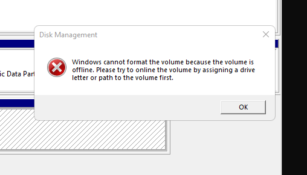
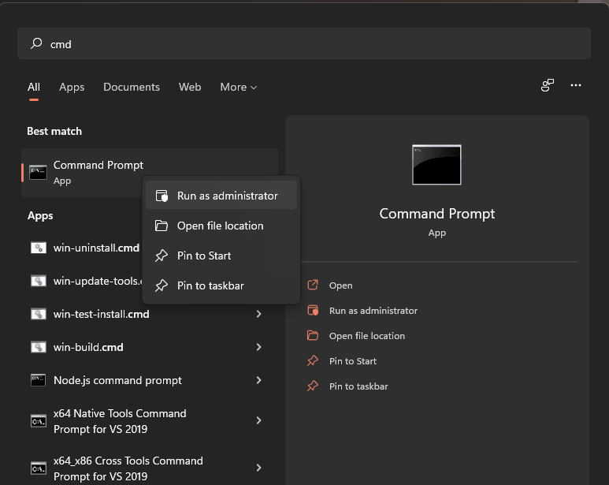
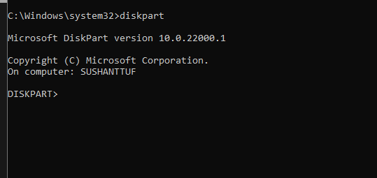
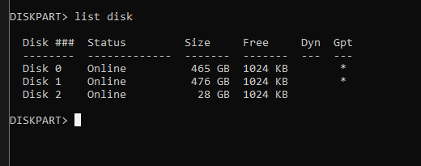
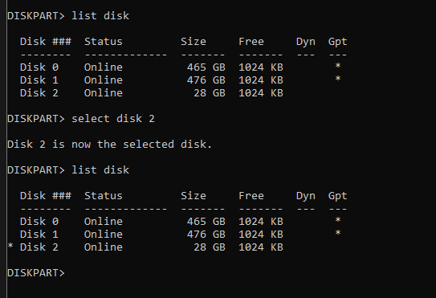
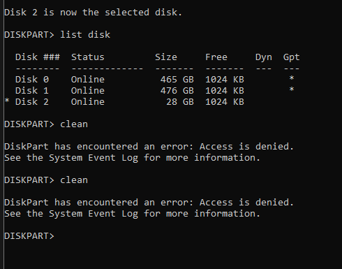
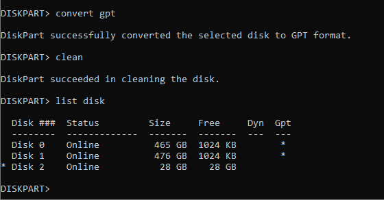
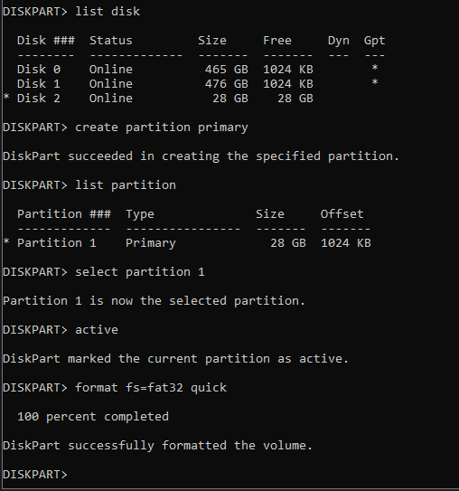
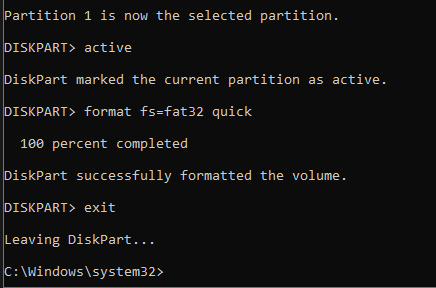

[](https://github.com/tterb/atomic-design-ui/blob/master/LICENSEs)

#
## FAQ
### What is this about?

There are situations where after using a USB flash drive as a Linux installation media it couldn't be brought back to its original state on a Windows PC.

When one tries to format it using windows GUI/File Manager error like **"DIRECTORY DOES NOT EXIST"** or something like below pops up when trying to format it using *Disk Management*... 




...so this guide/project is all about guiding the steps to make the USB flash drive back to life


### Are there any pre-requisites?
* Corrupted Flash Drive
* Windows PC


### Any specific question which haven't been addressed yet or anything in the same line? Feel free to **[raise and issue](https://github.com/Sushantdbg/reviveMyUSB/issues/new)** with your query.


#

## Tech Stack

* **Windows Command Line**
#

## Preface

Please consider the fact that the screenshots corresponding to steps below are *just for reference* which may/mayn't reflect same for your pc for example the disk number of flash drive.

All such factors are addressed on respective steps, as well as will be handled via warnings and explanations.

#### BEFORE WE GO AHEAD, PLEASE CONSIDER THE FACT THAT THIS PROJECT/INSTRUCTIONS IS/ARE PROVIDED “AS IS”, WITHOUT WARRANTY OF ANY KIND
#

## Instructions starts here

Step 1: Start CMD with admin privilege




Step 2:
```bash
diskpart
```





Step 3:
```bash
list disk
```





Step 4: <span style="color:red">Please make sure that the flash drive is the only one selected and not any system drive</span>


You can deduce the difference between flash drive and system drive by their respective sizes as shown in the **size column**.


```bash
select disk <disk number of flash drive>
```


Step 5: <span style="color:lavender">reassure the selected drive by the<span style="color:red"> <strong>"*"</strong> </span>asterisk sign before respective <strong>Disk ### column</strong></span>


```bash
list disk
```





Step 6:
```bash
clean
```




<span style="color:green"><strong>Step 7</strong> and <strong>8</strong> are only to be followed when you face the same error as seen in the above screenshot, after the <strong>clean</strong> command from <strong>Step 6</strong>; else <span style="color:yellow">you can skip them</span> to continue from <strong>Step 9</strong></span>


Step 7 <span style="color:yellow">(Optional)</span>:
```bash
convert gpt
```


Step 8 <span style="color:yellow">(Optional)</span>:
```bash
clean
```


Step 9:
```bash
list disk
```





Step 10:
```bash
create partition primary
```


Step 11:
```bash
list partition
```


Step 12:
```bash
select partition <number according to your personal flash drive>
```


Step 13:
```bash
active
```


Step 14:
```bash
format fs=fat32 quick
```





Step 15:
```bash
exit
```





### For a clear look at the whole CMD command as per my PC you can see [HERE 🡭](https://github.com/Sushantdbg/reviveMyUSB/blob/main/myWholeCMDas.txt)
## Contributing

Contributions are what make the open source community such an amazing place to learn, inspire, and create. Any contributions you make are **greatly appreciated**.

If you have a suggestion that would make this better, please fork the repo and create a pull request. You can also simply open an issue with the tag "enhancement".
Don't forget to give the project a star! Thanks again!

#### 1. Fork the Project
#### 2. Create your Feature Branch
#### 3. Commit your Changes
#### 4. Push to the Branch
#### 5. Open a Pull Request

## Contributors

- [Sushant Kumar](https://github.com/Sushantdbg)
- [Pallavi Kumari](https://github.com/Pallavikumarimdb)
